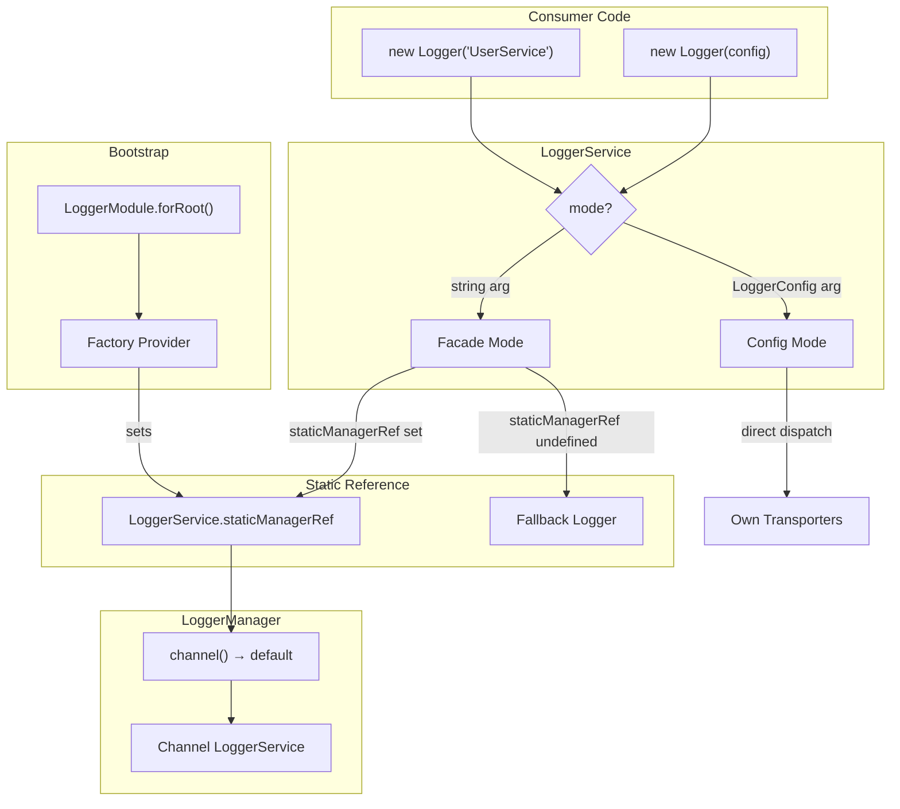

# Design Document: Logger Static Facade

## Overview

This design adds a static facade pattern to `LoggerService` so consumers can use
`new Logger('MyService')` without dependency injection, mirroring the NestJS
`Logger` pattern. The core idea: a static reference to `LoggerManager` is set
during module bootstrap, and facade-mode instances delegate log calls to the
resolved default channel at call time (lazy resolution).

The existing `LoggerConfig`-based constructor path remains untouched — this is a
purely additive change. Two operating modes coexist in a single class:

- **Facade Mode**: `new Logger('UserService')` — delegates to the static manager
- **Config Mode**: `new LoggerService({ transporters: [...] })` — direct, as
  today

### Key Design Decisions

1. **Runtime type check (`typeof arg === 'string'`)** to distinguish constructor
   overloads rather than separate classes. This keeps the public API surface
   minimal and avoids breaking the existing `Logger` alias export.

2. **Lazy delegation** — facade-mode instances resolve the default channel on
   every log call, not at construction time. This means instances created before
   `LoggerModule.forRoot()` automatically pick up the manager once it's set.

3. **Fallback logger** — a module-level `LoggerService` with a
   `ConsoleTransporter` handles early startup logging before the manager is
   wired. No logs are lost.

4. **Factory provider in `forRoot()`** — a dedicated provider sets the static
   reference after `LoggerManager` is instantiated, before `onModuleInit` runs.

## Architecture



### Call Flow — Facade Mode

1. Consumer calls `logger.info('message', { key: 'val' })`
2. `LoggerService` checks `this._mode === 'facade'`
3. Resolves delegate: `LoggerService.staticManagerRef?.channel()` or fallback
4. Merges `{ context: this._contextString }` + `this._sharedContext` + call
   context
5. Calls `delegate.info(message, mergedContext)`

### Call Flow — Config Mode (unchanged)

1. Consumer calls `logger.info('message', { key: 'val' })`
2. `LoggerService` checks `this._mode === 'config'`
3. Dispatches directly to own transporters (existing `dispatch()` method)

## Components and Interfaces

### Modified: `LoggerService` (`src/services/logger.service.ts`)

**New static members:**

```typescript
static staticManagerRef: LoggerManager | undefined = undefined;

static overrideLogger(manager: LoggerManager): void {
  LoggerService.staticManagerRef = manager;
}
```

**New instance members:**

```typescript
private readonly _mode: 'facade' | 'config';
private _contextString?: string;
```

**Constructor overloads:**

```typescript
constructor();                          // facade mode, no context
constructor(context: string);           // facade mode, with context
constructor(config: LoggerConfig);      // config mode (existing)
constructor(configOrContext?: LoggerConfig | string) {
  if (typeof configOrContext === 'string' || configOrContext === undefined) {
    // Facade mode
    this._mode = 'facade';
    this._contextString = configOrContext;
  } else {
    // Config mode (existing behavior)
    this._mode = 'config';
    this._config = configOrContext;
    this._transporters = configOrContext.transporters ?? [new ConsoleTransporter()];
    if (configOrContext.context) {
      this._sharedContext = { ...configOrContext.context };
    }
  }
}
```

**Delegate resolution (private):**

```typescript
private resolveDelegate(): LoggerService {
  if (LoggerService.staticManagerRef) {
    return LoggerService.staticManagerRef.channel();
  }
  return LoggerService._fallbackLogger;
}
```

**Fallback logger (private static):**

```typescript
private static _fallbackLogger: LoggerService = new LoggerService({
  transporters: [new ConsoleTransporter()],
});
```

### Modified: `LoggerModule` (`src/logger.module.ts`)

Add a factory provider to `forRoot()` that sets the static reference:

```typescript
{
  provide: 'LOGGER_STATIC_REF',
  useFactory: (manager: LoggerManager) => {
    LoggerService.staticManagerRef = manager;
    return manager;
  },
  inject: [LoggerManager],
}
```

This provider runs during DI resolution, before `onModuleInit` lifecycle hooks.

### Unchanged: `LoggerManager`

No changes needed. The manager already exposes `channel()` which returns the
default channel's `LoggerService`. The static facade simply calls into this
existing API.

### Unchanged: `LoggerInterface`

The `LoggerInterface` already defines `debug`, `info`, `warn`, `error`, `fatal`,
`withContext`, `withoutContext`, and `getTransporters`. No changes needed.

## Data Models

### Mode Discriminator

The `_mode` field is a simple string literal union:

```typescript
type LoggerMode = 'facade' | 'config';
```

### Context Merging (Facade Mode)

When a facade-mode instance dispatches a log call, context is merged in this
priority order (later wins):

1. Delegate channel's shared context (from `LoggerConfig.context`)
2. Facade instance's `_sharedContext` (from `withContext()` calls)
3. `{ context: _contextString }` (if `_contextString` is set)
4. Per-call context (the `context` parameter on `info()`, etc.)

### Fallback Logger

A static `LoggerService` instance in config mode with a single
`ConsoleTransporter` at default settings. Created once at module load time.
Replaced by the manager's default channel as soon as `staticManagerRef` is set.

## Correctness Properties

_A property is a characteristic or behavior that should hold true across all
valid executions of a system — essentially, a formal statement about what the
system should do. Properties serve as the bridge between human-readable
specifications and machine-verifiable correctness guarantees._

### Property 1: Constructor mode selection

_For any_ input that is either a non-empty string or a valid `LoggerConfig`
object, constructing a `LoggerService` with that input SHALL produce an instance
whose mode matches the input type — `'facade'` for strings, `'config'` for
`LoggerConfig` — and for strings, the stored context string SHALL equal the
input.

**Validates: Requirements 1.1, 1.2, 1.3**

### Property 2: overrideLogger sets static reference

_For any_ `LoggerManager` instance, calling
`LoggerService.overrideLogger(manager)` SHALL set
`LoggerService.staticManagerRef` to exactly that manager instance, replacing any
previously set reference.

**Validates: Requirements 2.3, 2.4**

### Property 3: Facade delegation with context merging

_For any_ facade-mode `LoggerService` instance with a context string, and _for
any_ log level method (`debug`, `info`, `warn`, `error`, `fatal`), calling that
method SHALL delegate to the default channel from the static manager, and the
delegated call's context SHALL contain `{ context: contextString }` merged with
any per-call context.

**Validates: Requirements 3.1, 3.2**

### Property 4: Facade withContext accumulation

_For any_ facade-mode `LoggerService` instance and _for any_ sequence of
`withContext` calls with arbitrary key-value pairs, subsequent log calls SHALL
include all accumulated context keys merged with the context string and per-call
context.

**Validates: Requirements 5.1**

### Property 5: Facade withoutContext removal

_For any_ facade-mode `LoggerService` instance with accumulated context, calling
`withoutContext(keys)` SHALL remove exactly those keys from subsequent log
calls, and calling `withoutContext()` with no arguments SHALL clear all
accumulated context while preserving the context string in delegated calls.

**Validates: Requirements 5.2, 5.3**

### Property 6: Config-mode isolation

_For any_ `LoggerConfig` with transporters and optional context, a config-mode
`LoggerService` instance SHALL dispatch log entries directly to its own
transporters with the config's shared context, regardless of whether a static
manager reference is set.

**Validates: Requirements 6.1, 6.2**

### Property 7: Facade accessor delegation

_For any_ facade-mode `LoggerService` instance while the static manager
reference is set, `getTransporters()` SHALL return the default channel's
transporters and `getConfig()` SHALL return the default channel's config.

**Validates: Requirements 8.1, 8.3**

## Error Handling

### Constructor Validation

- No explicit validation needed for the constructor argument. The `typeof` check
  cleanly separates strings from objects. Passing `undefined` (no args) falls
  into facade mode by design.
- Passing an invalid type (e.g., a number) is a TypeScript compile-time error
  since the overloads only accept `string`, `LoggerConfig`, or no args.

### Missing Static Manager Reference

- When `staticManagerRef` is `undefined`, facade-mode instances silently fall
  back to the fallback logger (a `ConsoleTransporter`). No error is thrown.
- This is intentional: early startup logging should work without configuration.

### Invalid Channel Resolution

- If `LoggerManager.channel()` throws (e.g., misconfigured default channel), the
  error propagates to the caller. This matches existing behavior — the manager
  already warns on `onModuleInit` if the default channel fails.

### Context Merging Edge Cases

- `withContext({})` is a no-op (merging empty object).
- `withoutContext([])` is a no-op (removing no keys).
- `withoutContext()` clears all shared context but preserves the context string.
- Per-call context keys override shared context keys (last-write-wins).

## Testing Strategy

### Property-Based Tests (via `fast-check` + `vitest`)

Install `fast-check` as a dev dependency. Each property test runs a minimum of
100 iterations with randomly generated inputs.

Each property test is tagged with:
`Feature: logger-static-facade, Property {N}: {title}`

| Property                        | What's Generated                                  | What's Verified                             |
| ------------------------------- | ------------------------------------------------- | ------------------------------------------- |
| P1: Constructor mode selection  | Random strings and LoggerConfig objects           | Correct mode and stored context             |
| P2: overrideLogger sets ref     | Mock LoggerManager instances                      | staticManagerRef identity                   |
| P3: Facade delegation + context | Random context strings, log levels, call contexts | Delegation target and merged context        |
| P4: withContext accumulation    | Random sequences of context objects               | All keys present in delegated calls         |
| P5: withoutContext removal      | Random context + random key subsets               | Correct keys removed/preserved              |
| P6: Config-mode isolation       | Random LoggerConfig + static manager set          | Own transporters called, manager not called |
| P7: Facade accessor delegation  | Random transporter configs via manager            | getTransporters/getConfig match channel     |

### Example-Based Unit Tests

| Scenario                                                                   | Validates         |
| -------------------------------------------------------------------------- | ----------------- |
| Constructor with no args → facade mode, no context                         | Req 1.4           |
| staticManagerRef initially undefined                                       | Req 2.1           |
| Fallback logger uses ConsoleTransporter                                    | Req 4.1           |
| Lazy resolution: log before manager set → fallback, log after → manager    | Req 3.3, 3.4, 4.2 |
| getTransporters without manager → fallback transporters                    | Req 8.2           |
| Config-mode withContext/withoutContext/getTransporters/getConfig unchanged | Req 6.3           |

### Integration Tests

| Scenario                                       | Validates    |
| ---------------------------------------------- | ------------ |
| `LoggerModule.forRoot()` sets staticManagerRef | Req 2.2, 7.1 |
| Static ref set before `onModuleInit` completes | Req 7.2      |

### Test Configuration

- Framework: Vitest (already configured)
- PBT library: `fast-check` (to be added as dev dependency)
- Minimum iterations: 100 per property test
- Tag format: `Feature: logger-static-facade, Property {N}: {title}`
